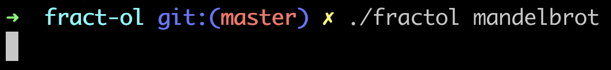
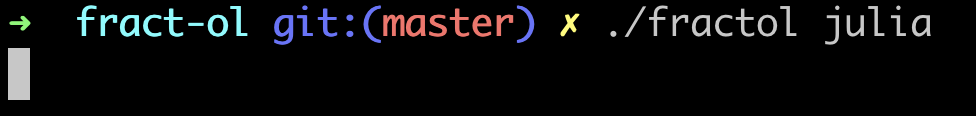
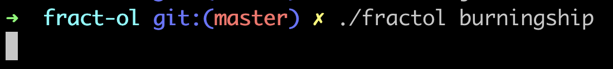
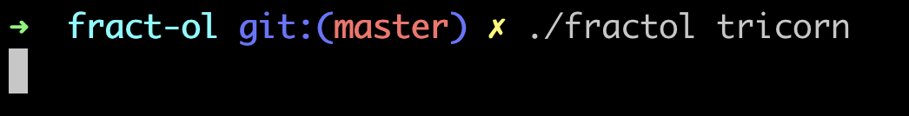

# fract-ol
<!-- First, get explanations about each fractals.
[fractals.md](fractals.md) -->
Copy and paste the script below to your bash.
```bash
git clone https://github.com/leeluna0476/fract-ol.git fract-ol
cd fract-ol
make
./fractol [fractal] [c.real] [c.imag]
```
Options:
- [fractal]: Enter the name of the fractal you want to see.
- [c.real] [c.imag]: Enter a complex number $c$ for julia set. (Only for julia set!)

---




---




---




---




---

You can click the buttons listed on the menu.
Try it!
