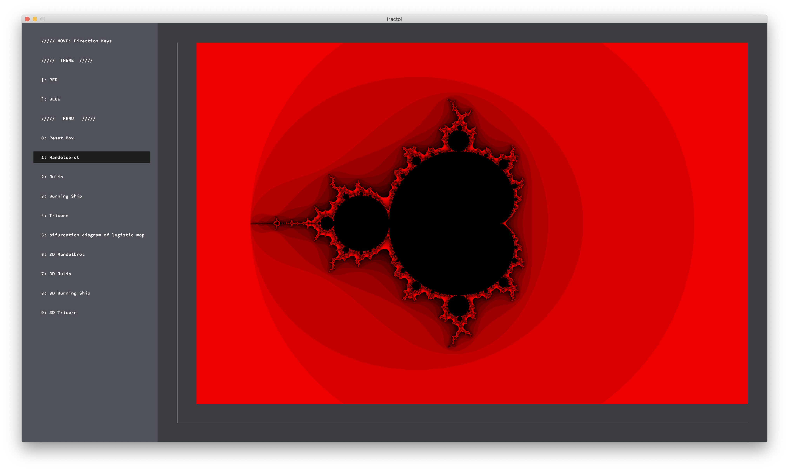
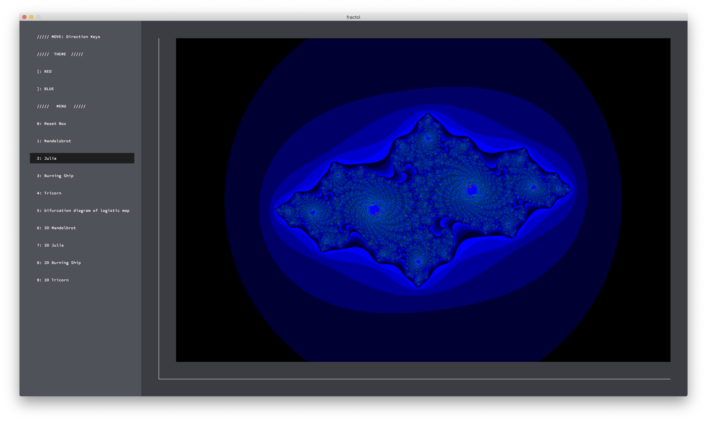

# fract-ol
[1. Arguments](## Arguments)

[2. Buttons](## Buttons)

---

<!-- First, get explanations about each fractals.
[fractals.md](fractals.md) -->
Copy and paste the script below to your bash.
```bash
git clone https://github.com/leeluna0476/fract-ol.git fract-ol
cd fract-ol
make
./fractol [fractal] [c.real] [c.imag]
```
Options:
- [fractal]: Enter the name of the fractal you want to see.
- [c.real] [c.imag]: Enter a complex number $c$ for julia set. (Only for julia set!)

## Arguments


```
./fractol mandelbrot
```

---


```
./fractol julia
```


```
./fractol julia -1.28 0.1
```

---


```
./fractol burningship
```

---


```
./fractol tricorn
```

## Buttons
You can click the buttons listed on the menu.
Try it!

|Button|Function|
|---|---|
|[|Theme RED|
|]|Theme BLUE|
|0|Reset Box|
|1|Mandelbrot set|
|2|Julia set|
|3|Burningship set|
|4|Tricorn set|

---

There are two themes: RED and BLUE.


---

You can call each set JUST by clicking the button.




