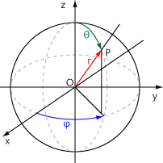
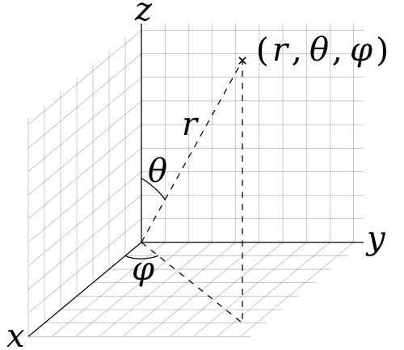

# 구면좌표계
구면좌표계는 공간을 나타내는 데 사용되는 좌표 시스템 중 하나이다.
두 개의 각도, 즉 고도각과 방위각을 사용하여 위치를 지정한다.

좌표(r, theta, phi)는 다음과 같이 정의된다. 주어진 점을 P라 하자.
- radius 반지름: 원점으로부터 P까지의 거리.
- theta 방위각: z축의 양의 방향으로부터 원점과 P가 이루는 직선까지의 각.
	방위각은 지점이 기준점으로부터 시계 방향으로 얼마나 돌아갔는지를 나타낸다.
	일반적으로 북쪽을 기준으로 0도부터 360도까지 측정한다.
- phi 고도각: x축의 양의 방향으로부터 원점과 P가 이루는 직선을 xy평면에 투영시킨 직선까지의 각.
	고도각은 지점이 수직선(수직 방향)으로부터 떨어진 각도를 나타낸다.
	0도는 수직선 위, 90도는 수평면 위, 180도는 수직선 아래를 가리킨다.

phi(고도각) 계산:
phi = arccos(j / radius)
	- j는 3차원 좌표에서의 y 좌표를 나타내며, radius는 3차원 좌표의 반지름이다.

theta(방위각) 계산:
theta = arccos(i / radius * sin(phi))
	- i는 3차원 좌표에서의 x 좌표를 나타내며, radius는 3차원 좌표의 반지름이다.

고도각과 방위각을 가지고 3차원 구면좌표 구하기:
x = radius * sin(phi) * cos(theta)
y = radius * sin(phi) * sin(theta)
z = radius * cos(phi)

3차원 공간을 표현하기 위해서는 x, y, z를 알아야 하는데, x, y는 알고 있지만 z는 모르기 때문에 x, y를 가지고 phi와 theta를 구해서 다시 x, y, z를 구한다.
